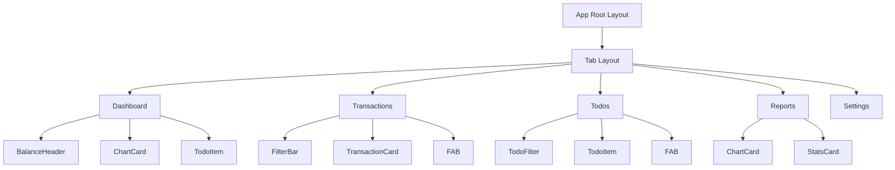

# Mobile Finance Todo App Design Document

## Overview

This design document outlines the architecture and implementation for a mobile finance and todo application that combines personal finance tracking (expense/income) with task management. The app is built using Expo (React Native), TypeScript, Expo Router, and NativeWind (Tailwind for React Native).

### Core Features
- Personal finance tracking (income/expense management)
- Todo list management with priorities and due dates
- Clean, modern UI with dark/light theme support
- One-handed usage optimized for mobile devices
- Performance-optimized lists and interactions

## Technology Stack & Dependencies

### Frontend Framework
- **React Native** (v0.79.5) with **Expo** (v53.0.9)
- **TypeScript** (v5.8.3) for type safety
- **Expo Router** (v5.1.3) for file-based navigation
- **NativeWind** (v4.1.23) for Tailwind CSS styling

### UI & Styling
- **Tailwind CSS** (v3.3.5) with NativeWind integration
- **Lucide React Native** for consistent iconography
- **@rn-primitives** components for accessible UI elements
- **React Native Reanimated** for smooth animations

### State Management & Data
- React Context API for theme and global state
- AsyncStorage for local data persistence
- Mock data services (future Supabase integration ready)

## Architecture

### File Structure
```
app/
├── _layout.tsx                    # Root layout with theme/provider setup
├── (tabs)/
│   ├── _layout.tsx               # Bottom tab navigation
│   ├── dashboard.tsx             # Balance overview & today's tasks
│   ├── transactions.tsx          # Transaction list with filters
│   ├── todos.tsx                 # Todo management
│   ├── reports.tsx               # Charts and analytics
│   └── settings.tsx              # App settings
├── add-transaction.tsx           # Transaction form
└── add-todo.tsx                  # Todo form

src/
├── shared/
│   ├── ui/                       # Reusable UI components
│   └── components/               # Business logic components
├── mocks/                        # Mock data services
└── types/                        # TypeScript type definitions
```

### Component Architecture

#### Core UI Components

**Layout & Navigation**
- `Header` - Consistent page headers with optional actions
- `TabBar` - Bottom navigation with accessibility support
- `FAB` (Floating Action Button) - Primary action trigger

**Finance Components**
- `BalanceHeader` - Total balance display with income/expense chips
- `TransactionCard` - Individual transaction display with swipe actions
- `BudgetProgress` - Progress indicators for budget tracking
- `FilterBar` - Transaction filtering with category/date/type pills

**Todo Components**  
- `TodoItem` - Checkbox, title, due date, priority badge with swipe actions
- `PriorityBadge` - Visual priority indicators (Low/Medium/High)
- `TodoFilter` - Filter tabs (All/Today/This Week/Completed)

**Form Components**
- `FormField` - Consistent form field wrapper
- `SelectSheet` - Bottom sheet selection for categories/priorities
- `DateTimePicker` - Date/time input wrapper
- `AmountInput` - Numeric keyboard optimized amount entry

**Data Visualization**
- `ChartCard` - Placeholder chart components for reports
- `StatsCard` - Key metric displays

**State Components**
- `EmptyState` - Consistent empty state displays
- `LoadingOverlay` - Loading indicators
- `ErrorState` - Error handling displays

#### Component Hierarchy



## Data Models & State Management

### Core Data Types

```typescript
type Transaction = {
  id: string;
  type: 'income' | 'expense';
  category: string;
  title: string;
  note?: string;
  amount: number;
  date: string;
  wallet?: string;
}

type Todo = {
  id: string;
  title: string;
  description?: string;
  done: boolean;
  priority: 'low' | 'medium' | 'high';
  due?: string;
  tags?: string[];
  createdAt: string;
}

type Category = {
  id: string;
  name: string;
  icon: string;
  color: string;
  type: 'income' | 'expense';
}
```

### State Architecture

**Global State (Context)**
- Theme preference (light/dark/system)
- User preferences (currency, first day of week)
- Authentication state (future Supabase integration)

**Local State Management**
- Transaction list state with filtering/sorting
- Todo list state with completion tracking
- Form state for add/edit operations
- Loading/error states for async operations

### Mock Data Services

**Finance Service**
```typescript
// src/mocks/finance.ts
export const mockTransactions: Transaction[] = [
  // 15-20 sample transactions across categories
]

export const mockCategories: Category[] = [
  // Standard expense/income categories
]
```

**Todo Service**
```typescript  
// src/mocks/todos.ts
export const mockTodos: Todo[] = [
  // 15-20 sample todos with various priorities/dates
]
```

## Screen Specifications

### Dashboard Screen
**Purpose**: Overview of financial status and today's tasks

**Layout Components**:
- `BalanceHeader` - Total balance, income vs expense summary
- Mini charts section - "Spending this month", "Top categories" 
- "Today's tasks" section - 3 upcoming todos + "View all" button
- Recent transactions preview

**Interactions**:
- Pull-to-refresh for data updates
- Tap balance to toggle visibility
- Navigation to detailed views

### Transactions Screen  
**Purpose**: Complete transaction history with filtering

**Layout Components**:
- `FilterBar` - Category, type, date range filters
- Search input for transaction titles/notes
- `FlatList` with `TransactionCard` items
- Sticky month headers for grouping
- `FAB` for adding new transactions

**Interactions**:
- Swipe-to-delete on transaction cards
- Filter pill selection opens bottom sheets
- Infinite scroll with pagination
- Pull-to-refresh

### Add/Edit Transaction Screen
**Purpose**: Transaction creation and modification

**Form Fields**:
- Amount input (numeric keyboard)
- Transaction type toggle (income/expense)  
- Category selection (bottom sheet)
- Date picker
- Title and notes (optional)
- Wallet selection (if multiple wallets)

**Interactions**:
- Save button (primary)
- Delete button (edit mode only)
- Form validation with error states

### Todos Screen
**Purpose**: Task management with priority and scheduling

**Layout Components**:
- `TodoFilter` tabs - All/Today/This Week/Completed
- `FlatList` with `TodoItem` components
- Priority-based visual grouping
- `FAB` for new todo creation

**Interactions**:
- Swipe gestures for complete/delete
- Checkbox tap for quick completion
- Drag-to-reorder (optional)
- Filter tab switching

### Add/Edit Todo Screen
**Purpose**: Task creation and modification

**Form Fields**:
- Title (required)
- Description (optional)
- Due date/time picker
- Priority selection (Low/Medium/High)
- Tag input for categorization

**Interactions**:
- Save/Update primary action
- Delete option (edit mode)
- Priority visual feedback

### Reports Screen
**Purpose**: Financial analytics and insights

**Layout Components**:
- Month/period selector
- Chart cards for spending patterns
- Category breakdown pie chart
- Income vs expense trends
- Budget progress indicators

**Interactions**:
- Date range selection
- Chart interaction (zoom, details)
- Export functionality placeholders

### Settings Screen
**Purpose**: App configuration and preferences

**Settings Groups**:
- Appearance: Theme selection, dark mode
- Currency: Primary currency selection  
- Localization: First day of week, date format
- Data: Backup/sync placeholders (future)
- About: App version, terms, privacy

## UI Design System

### Typography Scale
- **Title**: `text-2xl font-semibold` - Screen headers
- **Section**: `text-lg font-semibold` - Section headers  
- **Body**: `text-base leading-relaxed` - Primary content
- **Caption**: `text-xs text-muted-foreground` - Secondary info

### Color System Extension
```javascript
// tailwind.config.js theme extension
colors: {
  // Existing colors maintained
  success: {
    DEFAULT: 'hsl(var(--success))',
    foreground: 'hsl(var(--success-foreground))',
  },
  warning: {
    DEFAULT: 'hsl(var(--warning))',
    foreground: 'hsl(var(--warning-foreground))',
  },
  danger: {
    DEFAULT: 'hsl(var(--destructive))',
    foreground: 'hsl(var(--destructive-foreground))',
  },
}
```

### Spacing & Layout
- **Screen padding**: `px-4 py-4` - Consistent page margins
- **Component gaps**: `gap-3` (12px), `gap-4` (16px), `gap-6` (24px)
- **Card radius**: `rounded-xl` - Card components
- **Button radius**: `rounded-lg` - Interactive elements
- **FAB radius**: `rounded-full` - Floating action button

### Interactive Elements
- **Minimum touch target**: 44pt (iOS guideline)
- **Button heights**: `h-11` (44px minimum)
- **Active states**: Scale and opacity feedback
- **Focus indicators**: Ring utilities for accessibility

## Interaction Design

### Gestures & Animations
- **Swipe Actions**: Left swipe reveals delete/edit actions on cards
- **Pull-to-Refresh**: Standard refresh pattern on lists
- **Haptic Feedback**: Success confirmations on completions
- **Loading States**: Skeleton screens and smooth transitions

### Navigation Patterns
- **Bottom Tabs**: Primary navigation with badge indicators
- **Stack Navigation**: Modal-style for forms and details  
- **Bottom Sheets**: Selection and filtering interfaces
- **FAB Placement**: Bottom-right, above tab bar

### Performance Optimizations
- **FlatList Configuration**: 
  - `keyExtractor` for stable keys
  - `getItemLayout` where possible
  - `removeClippedSubviews` for large lists
  - `maxToRenderPerBatch` optimization
- **Component Memoization**: React.memo for list items
- **Image Optimization**: Lazy loading for category icons

## Accessibility

### Screen Reader Support
- Semantic `accessibilityRole` attributes
- Descriptive `accessibilityLabel` properties  
- `accessibilityHint` for complex interactions
- Proper heading hierarchy with `accessibilityLevel`

### Motor Accessibility
- Minimum 44pt touch targets
- Adequate spacing between interactive elements
- Alternative interaction methods for swipe gestures
- Focus management for keyboard navigation

### Visual Accessibility  
- High contrast color combinations
- Scalable font sizes respecting system settings
- Clear visual hierarchy and information grouping
- Reduced motion preferences respected

## Testing Strategy

### Component Testing
- Unit tests for utility functions and data transformations
- Component rendering tests with React Native Testing Library
- Mock data service tests for data integrity
- Form validation and error handling tests

### Integration Testing
- Navigation flow testing between screens
- State management integration across components
- Mock API integration testing
- Theme switching functionality

### Performance Testing
- List rendering performance with large datasets
- Memory usage monitoring for data-heavy operations
- Animation performance profiling
- Startup time optimization validation

## Future Considerations

### Supabase Integration
- Authentication flow with existing UI components
- Real-time sync for transactions and todos  
- Offline-first data architecture
- Multi-device synchronization

### Enhanced Features
- Receipt photo capture and OCR
- Recurring transaction automation
- Advanced reporting with custom date ranges
- Export functionality (CSV, PDF)
- Push notifications for due tasks
- Widget support for quick access

### Scalability
- Database schema optimization for performance
- Caching strategies for frequently accessed data
- Background sync for offline-first experience
- Multi-currency support expansion